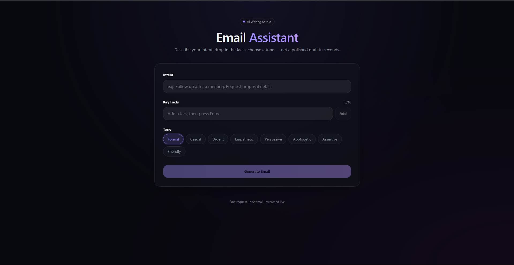

# Email Generation Assistant

An AI-powered email generation system built with LangGraph, FastAPI, and an advanced
three-technique prompting strategy (Role-Playing + Few-Shot + Chain-of-Thought). The
system generates professional emails from three structured inputs — intent, key facts,
and tone — and includes a complete custom evaluation pipeline for comparing model
performance.

Built as part of an AI Engineer candidate assessment.

---

## Demo Video

[](https://drive.google.com/file/d/1TWkTnP2uQ3m1N7ea4VlHD0X_xQwTwHoj/view?usp=sharing)

Click the thumbnail above to watch a full walkthrough of the system — frontend input,
live WebSocket streaming, and the generated email output.

---

## Table of Contents

- [Architecture Overview](#architecture-overview)
- [Tech Stack](#tech-stack)
- [Project Structure](#project-structure)
- [Setup](#setup)
- [Running the Backend](#running-the-backend)
- [Terminal CLI Demo](#terminal-cli-demo)
- [Prompt Engineering Strategy](#prompt-engineering-strategy)
- [Evaluation System](#evaluation-system)
- [Custom Metrics](#custom-metrics)
- [Model Comparison Results](#model-comparison-results)
- [Comparative Analysis](#comparative-analysis)
- [API Reference](#api-reference)

---

## Architecture Overview

```
Client (frontend)
        │  WebSocket  /ws/generate
        ▼
FastAPI Backend
        │
        ├── LangGraph Email Generation Pipeline
        │       ├── validate_input    — input validation, tone whitelist check
        │       ├── build_prompt      — Role-Playing + Few-Shot + CoT prompt assembly
        │       └── generate_email    — LLM call (OpenAI or Ollama), CoT/email parsing
        │
        └── Evaluation Pipeline (standalone script)
                ├── 10 fixed test scenarios with human reference emails
                ├── Metric 1 — Fact Recall (embedding cosine similarity)
                ├── Metric 2 — Tone Adherence (LLM-as-judge)
                ├── Metric 3 — Structural Completeness (rule-based)
                └── Output: per-model CSV/JSON + comparison_report.json
```

The same LangGraph pipeline is used by both the live API and the evaluation script —
the evaluation measures exactly what a user would experience, not a re-implementation
of the generation logic.

---

## Tech Stack

| Layer | Technology |
|---|---|
| Orchestration | LangGraph |
| API framework | FastAPI, Uvicorn |
| Real-time transport | WebSockets (token streaming) |
| Validation | Pydantic v2 |
| LLM provider A | OpenAI API (GPT-4o-mini / GPT-5.4-mini) |
| LLM provider B | Ollama (Qwen3-8B, local, OpenAI-compatible endpoint) |
| Embeddings | OpenAI `text-embedding-3-small` (Fact Recall metric) |
| LLM-as-Judge | OpenAI GPT-4o-mini (Tone Adherence + held-fixed evaluator) |
| Evaluation output | CSV, JSON |
| Language | Python 3.11+ |

---

## Project Structure

```
email-gen-assistant/
├── assets/
│   └── frontend-interface.png      # frontend screenshot, demo video thumbnail
│
├── backend/
│   ├── main.py                    # FastAPI app, WebSocket + REST endpoints
│   ├── config.py                  # env vars, model names, tone options
│   ├── graph/
│   │   ├── state.py                # LangGraph state schema
│   │   ├── prompt_engineering.py   # Role-Playing + Few-Shot + CoT prompt templates
│   │   ├── nodes.py                # validate_input, build_prompt, generate_email
│   │   └── graph.py                # LangGraph graph assembly
│   └── models/
│       └── schemas.py              # Pydantic request/response models
│
├── evaluation/
│   ├── scenarios.json              # 10 test scenarios + human reference emails
│   ├── run_eval.py                 # evaluation runner (CLI)
│   ├── analysis.ipynb              # comparative plots generation notebook
│   ├── metrics/
│   │   ├── fact_recall.py          # Metric 1 — embedding cosine similarity
│   │   ├── llm_judge.py            # Metric 2 — Tone Adherence (LLM-as-judge)
│   │   └── structural.py           # Metric 3 — Structural Completeness (rule-based)
│   └── results/
│       ├── model_a_results.csv
│       ├── model_b_results.csv
│       ├── model_a_detail.json
│       ├── model_b_detail.json
│       └── plots/
│           ├── plot_aggregate_metrics.png
│           └── plot_per_scenario_composite.png
│
├── run_cli.py                       # interactive terminal demo (no server needed)
├── requirements.txt
├── .env.example
└── README.md
```

---

## Setup

### Prerequisites

- Python 3.11 or higher
- An OpenAI API key (used for Model A generation, the LLM judge, and embeddings)
- [Ollama](https://ollama.com) installed locally, for Model B (Qwen3-8B)

### 1. Clone the repository

```bash
git clone https://github.com/FahimS45/email-gen-assistant.git
cd email-gen-assistant
```

### 2. Create a virtual environment and install dependencies

```bash
python -m venv .venv

# macOS / Linux
source .venv/bin/activate

# Windows
.venv\Scripts\activate

pip install -r requirements.txt
```

### 3. Configure environment variables

```bash
cp .env.example .env
```

Edit `.env` and fill in your OpenAI API key:

```dotenv
OPENAI_API_KEY=sk-...
OPENAI_MODEL=gpt-5.4-mini-2026-03-17

OLLAMA_BASE_URL=http://localhost:11434/v1
OLLAMA_MODEL=qwen3:8b

EMBEDDING_MODEL=text-embedding-3-small

JUDGE_MODEL=gpt-4o-mini

APP_HOST=0.0.0.0
APP_PORT=8000
```

`.env` lives at the project root, alongside `requirements.txt`.

### 4. Set up Ollama (Model B)

```bash
ollama pull qwen3:8b
ollama serve
```

Keep `ollama serve` running in a separate terminal. Verify it's reachable:

```bash
ollama list
curl http://localhost:11434/v1/chat/completions \
  -H "Content-Type: application/json" \
  -d '{"model": "qwen3:8b", "messages": [{"role": "user", "content": "Say hello."}]}'
```

Qwen3-8B at 4-bit quantization runs comfortably on an 8GB GPU (tested on an RTX 3070 Ti).

---

## Running the Backend

From the project root:

```bash
uvicorn backend.main:app --reload --host 0.0.0.0 --port 8000
```

Verify the server is up:

```bash
curl http://localhost:8000/health
curl http://localhost:8000/tones
```

Interactive API docs are available at `http://localhost:8000/docs`.

---

## Terminal CLI Demo

`run_cli.py` runs the complete generation pipeline directly in the terminal — no
server, no frontend, no WebSocket client needed. It calls the exact same LangGraph
nodes (`validate_input`, `build_prompt`, `generate_email_stream`) used by the FastAPI
backend, so its behavior is identical to what the live API produces.

This is useful for quickly testing the system, verifying an Ollama setup, or as a
fallback demo path.

```bash
python run_cli.py
```

You'll be walked through:

1. **Intent** — typed freely
2. **Key facts** — one per line, blank line to finish (up to 10)
3. **Tone** — chosen from a numbered menu of the fixed `TONE_OPTIONS`
4. **Model** — `openai` or `ollama`

The email streams to the terminal token-by-token as it's generated, followed by the
parsed Chain-of-Thought reasoning and the final clean email. After each generation
you're asked whether to run another scenario or exit.

### Frontend integration

The frontend connects to `ws://localhost:8000/ws/generate` and sends:

```json
{
  "intent": "Follow up on a job application submitted two weeks ago",
  "key_facts": ["Applied on June 2nd", "Role is Senior Product Manager"],
  "tone": "formal",
  "model": "openai"
}
```

The server streams back JSON messages of type `token` (incremental), `cot`
(chain-of-thought, once), `email` (final clean output, once), `done` (close signal),
and `error`.

---

## Prompt Engineering Strategy

The system combines three prompting techniques into a single hybrid strategy, defined
in `backend/graph/prompt_engineering.py`:

**1. Role-Playing.** The model is cast as a senior communication director with an
explicit professional code (always include every fact, calibrate tone precisely,
never pad). This primes more disciplined, polished output than a bare instruction.

**2. Few-Shot Examples.** Two fully worked examples — one formal, one casual — each
showing the complete expected format: input, step-by-step reasoning, and final email.
This calibrates tone, structure, and fact-inclusion behavior without additional
instruction.

**3. Chain-of-Thought (CoT).** The model is required to reason inside `<thinking>`
tags before drafting, explicitly covering: the core goal, every fact and where it
belongs, the vocabulary/register the tone demands, and the intended structure. The
final email is produced inside `<email>` tags. CoT is parsed out server-side
(`extract_cot_and_email`) and never shown to the end user as part of the email, but is
retained in state for inspection and debugging.

This combination directly targets the three custom metrics: Few-Shot and Role-Playing
improve Tone Adherence and Structural Completeness; CoT's explicit fact-enumeration
step improves Fact Recall.

---

## Evaluation System

The evaluation pipeline runs the 10 fixed test scenarios (`evaluation/scenarios.json`)
through the exact same LangGraph pipeline used in production, scores each output with
three custom metrics, and writes structured CSV/JSON reports.

Run from the project root:

```bash
# Single model
python -m evaluation.run_eval --model openai --label model_a
python -m evaluation.run_eval --model ollama --label model_b

# Both models + comparison report in one run
python -m evaluation.run_eval --compare

# Smoke test without spending API credits (keyword-overlap fact recall)
python -m evaluation.run_eval --model openai --keyword-fact-recall
```

Outputs are written to `evaluation/results/`:

- `{label}_results.csv` — per-scenario scores, readable in any spreadsheet tool
- `{label}_detail.json` — full detail including per-fact similarity scores and judge justifications
- `comparison_report.json` — aggregate comparison across both models (only with `--compare`)

---

## Custom Metrics

Three custom metrics were designed specifically for email generation quality, covering
three independent dimensions: content (facts), style (tone), and form (structure). A
high score on one metric does not imply a high score on another by construction — an
email can include every fact and still fail on tone, or read well but be missing a
sign-off.

### Metric 1 — Fact Recall (embedding cosine similarity)

**What it measures:** Of the user-supplied key facts, how well does the generated
email's content semantically cover them.

**Logic:** Each key fact and each sentence-level chunk of the generated email is
embedded with `text-embedding-3-small`. For every fact, the maximum cosine similarity
across all email chunks is taken (max-pooling — a fact present anywhere in the email
should score well regardless of position). A fact is marked "found" if its max
similarity is ≥ 0.65. The overall score is the **mean of per-fact similarity scores**
across all facts — not just the binary found/not-found fraction — which produces a
continuous, differentiating score rather than a metric that saturates at 1.0 the
moment every fact is technically present.

**Why this approach:** An earlier version of this metric used LLM-as-judge fact
checking, which proved too lenient — both models scored a perfect 1.0 across every
scenario, giving zero signal for comparison. Embedding similarity is graded by
construction, is roughly 10x cheaper (one batched embeddings call vs. one chat
completion per scenario), and is more consistent run-to-run than an LLM judge's
variable leniency.

### Metric 2 — Tone Adherence (LLM-as-judge)

**What it measures:** Whether the email's actual register, word choice, and sentence
structure match the *requested* tone — independent of whether the email is well-written
in some generic sense.

**Logic:** GPT-4o-mini is given the target tone and the generated email, and scores
tone match on a rubric-anchored 1–5 Likert scale (5 = unmistakable and consistent tone
alignment, 1 = opposite or unrelated to the requested tone). The raw score is
normalized to `[0, 1]` via `(score - 1) / 4` for comparability with the other two
metrics.

**Why LLM-as-judge here:** Tone is a holistic, partly subjective stylistic judgment
(formality of vocabulary, sentence length, contraction use, directness, warmth) that
does not reduce well to a regex or keyword check. A rubric-anchored LLM judge is the
practical standard for operationalizing this kind of qualitative assessment at scale.

### Metric 3 — Structural Completeness (rule-based)

**What it measures:** Whether the generated output has the shape of a real, sendable
email — independent of its factual or tonal quality.

**Logic:** Five binary checks, each worth 0.2 of the final score:

1. Has a `Subject:` line near the top
2. Has a recognizable greeting (`Dear`, `Hi`, `Hello`, etc.)
3. Has a non-trivial body (≥ 25 words)
4. Has a recognizable sign-off (`Regards`, `Sincerely`, `Best`, `Cheers`, etc.)
5. Contains no leaked chain-of-thought tags, AI self-reference, or unfilled template
   placeholders

**Why rule-based, not LLM:** This is a fully deterministic check with no external data
to validate — every input is a known string processed by regex. An LLM call would add
latency and cost with no accuracy benefit over a handful of well-tested pattern checks.
This metric is also the cheapest in the pipeline (zero API calls) and runs instantly.

### Composite Score

The unweighted mean of the three metrics above, reported per scenario and as a model
average, in `[0, 1]`.

---

## Model Comparison Results

Two model/prompting configurations were evaluated against the identical 10 scenarios
and identical evaluation pipeline. The LLM judge (Tone Adherence) and the embedding
model (Fact Recall) were held fixed at GPT-4o-mini and `text-embedding-3-small`
respectively for both runs, to ensure the comparison measures generation quality, not
judge variance.

| Metric | Model A — GPT-5.4-mini | Model B — Qwen3-8B (Ollama, local) |
|---|---|---|
| Fact Recall (avg) | 0.519 | 0.517 |
| Tone Adherence (avg, 0–1) | 0.925 | 0.875 |
| Structural Completeness (avg) | 0.920 | 0.920 |
| Composite Score (avg) | 0.788 | 0.771 |
| Success rate | 10/10 | 10/10 |

*Generator: GPT-5.4-mini (`gpt-5.4-mini-2026-03-17`) for Model A; Qwen3-8B (4-bit,
local via Ollama) for Model B. Judge/embedding model held fixed: GPT-4o-mini /
`text-embedding-3-small`.*

Full per-scenario raw data is available in `evaluation/results/model_a_results.csv`
and `evaluation/results/model_b_results.csv`, with extended detail (per-fact
similarity scores, judge justifications) in the corresponding `_detail.json` files.

---

## Comparative Analysis

**Which model performed better.** GPT-5.4-mini outperforms Qwen3-8B on the composite
score (0.788 vs. 0.771), driven almost entirely by Tone Adherence (0.925 vs. 0.875).
Fact Recall and Structural Completeness are effectively tied between the two models —
both follow the Chain-of-Thought fact-enumeration step and the Role-Playing/Few-Shot
structural conventions reliably regardless of model size.

**Biggest failure mode of the lower-performing model.** Qwen3-8B's weakest area is
tone consistency rather than content or structure. Several scenarios show the model
drifting toward a more neutral or generically formal register even when the requested
tone was distinct (e.g. `casual`, `assertive`), losing the registers' specific
vocabulary and sentence rhythm partway through longer emails. This is consistent with
a smaller model's prompt-following degrading over longer generations, whereas fact
inclusion (front-loaded by the CoT step) and structural conventions (rigidly
demonstrated in the few-shot examples) hold up regardless of model size.

**Production recommendation.** **Qwen3-8B is recommended for production**, run
self-hosted via Ollama. The performance gap between the two models is narrow (0.017
composite score) and concentrated almost entirely in one of three metrics — Fact
Recall and Structural Completeness show no meaningful difference. Weighed against
that narrow gap, GPT-5.4-mini is priced at $0.75 / 1M input tokens and $4.50 / 1M
output tokens, while Qwen3-8B has zero marginal per-request cost once deployed and
runs comfortably on a single consumer GPU (tested at ~5–6GB VRAM on an RTX 3070 Ti,
4-bit quantization). Combined with Qwen3-8B's Apache 2.0 license — unrestricted
commercial self-hosting, no dependency on a third-party API's uptime or rate limits,
and no email content leaving the deployment environment — the cost-to-quality trade
favors the open-weight model for this use case. The residual tone-adherence gap is
small enough to be addressed through targeted prompt refinement on the
lower-scoring tones (casual, empathetic) rather than by accepting a recurring
per-token API cost for a marginal, single-metric improvement.

---

## API Reference

| Endpoint | Method | Description |
|---|---|---|
| `/health` | GET | Liveness probe |
| `/tones` | GET | Returns the fixed list of valid tone options |
| `/generate` | POST | Non-streaming generation (used by the evaluation pipeline) |
| `/ws/generate` | WebSocket | Streaming generation (used by the frontend) |

Full interactive schema available at `/docs` once the server is running.

---

## License

This project is licensed under the MIT License — see the [LICENSE](LICENSE) file for details.
